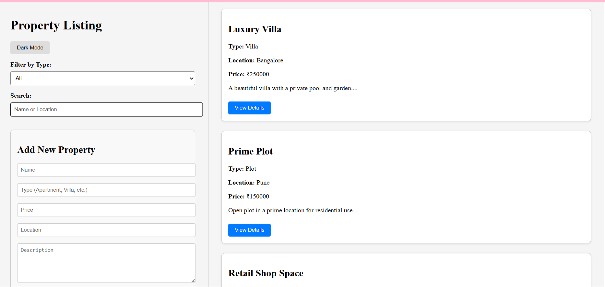
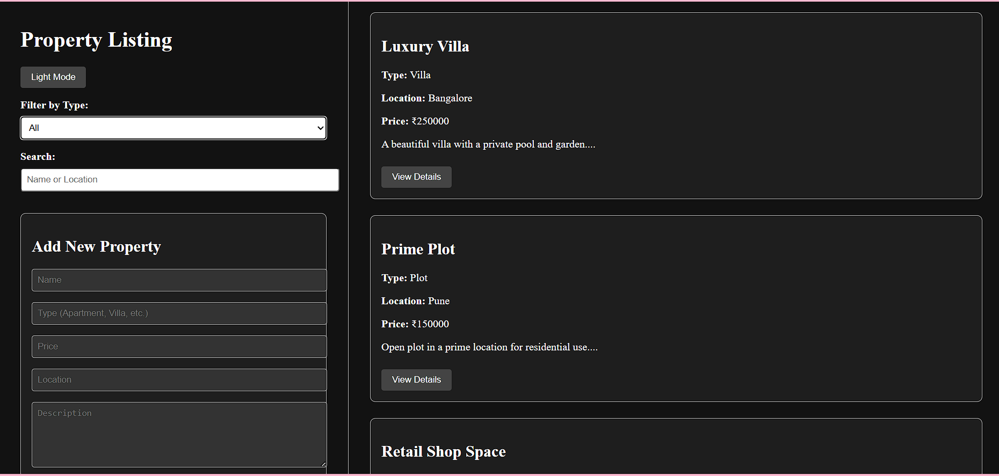
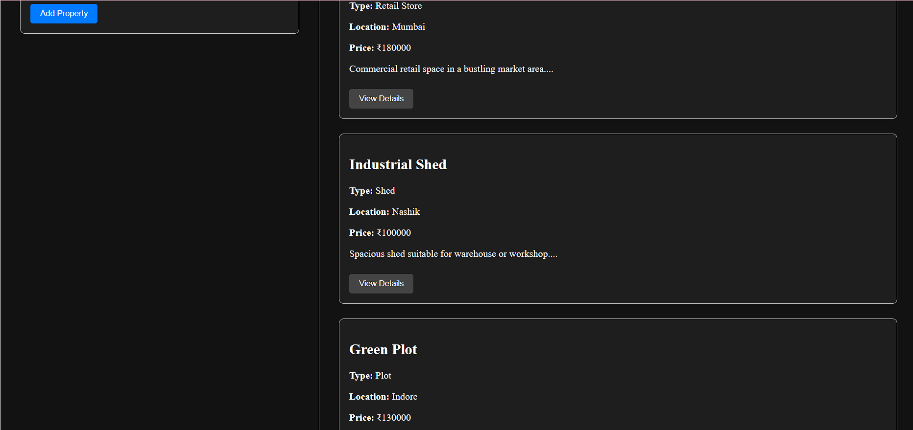
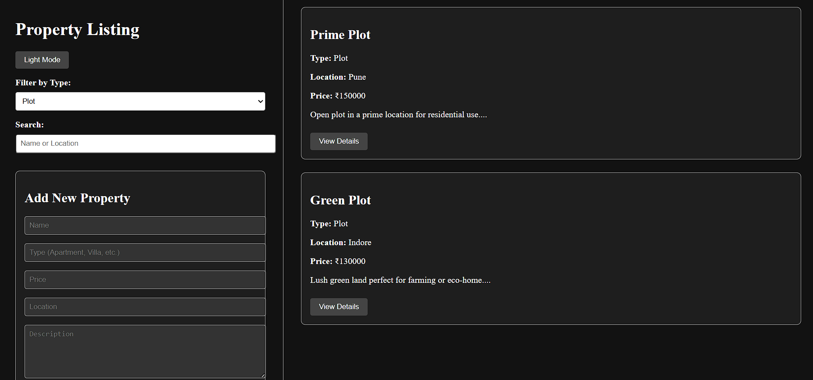
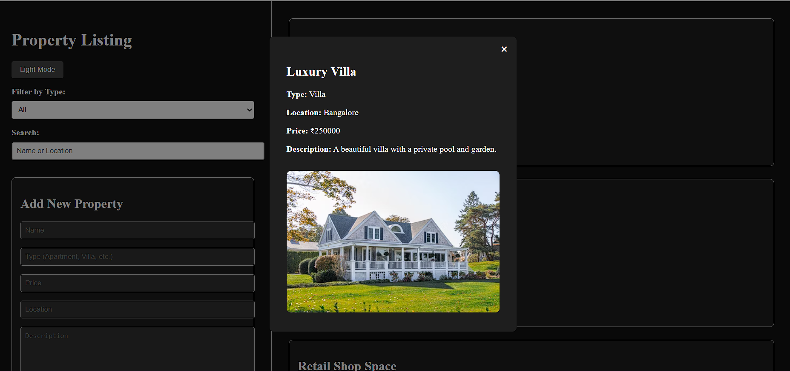

# 🏡 Property Listing App

A responsive React + TypeScript-based Property Listing App where users can view, filter, and explore property cards dynamically fetched from a MockAPI backend.

---

## 🚀 Features

- 🔍 Filterable list of properties (type, location, price)
- 📄 Detailed property descriptions
- 📱 Responsive card layout
- ⚡️ Fast and interactive UI
- 🧑‍💻 Built with React + TypeScript

---

## 🔍 Project UI Preview
  ## 🔥 UI Preview

### 🖼️ Full UI View

### 🏠 Property Cards Display

### 🏠 Filter the  Property by type

### 🏠 Choose  Property 

---

## 🛠 Tech Stack

- React
- TypeScript
- Tailwind CSS
- MockAPI

---

